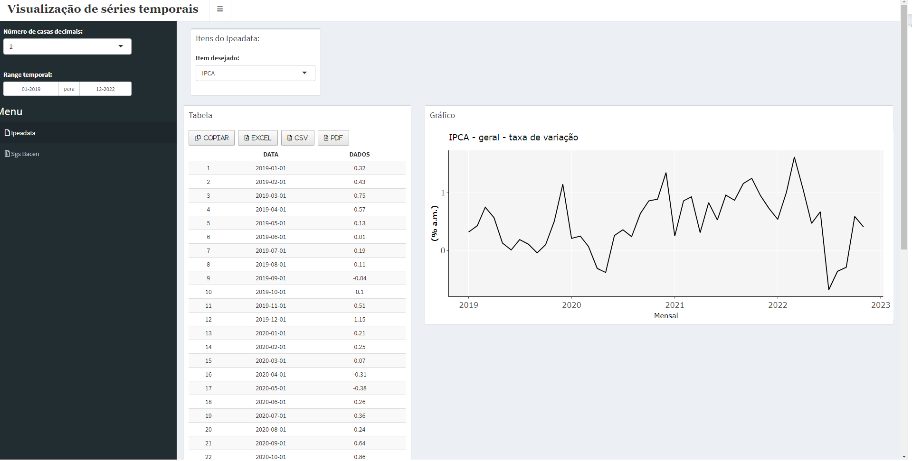
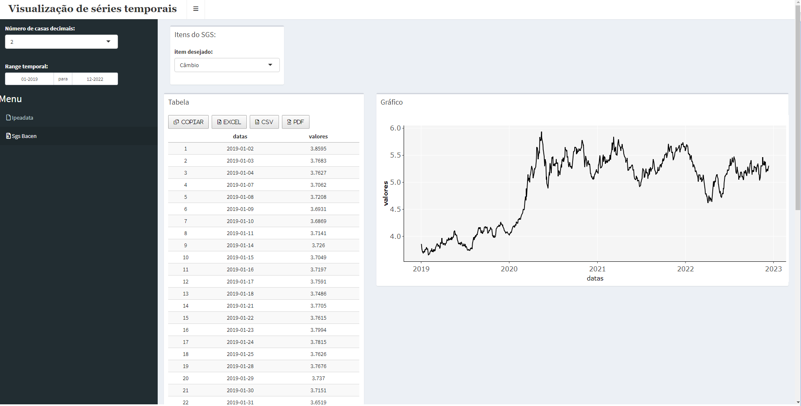

# Shiny time series

Shiny app for viewing time series.

<div>
  
  
</div>

This application uses the [Ipeadata's](http://ipeadata.gov.br/) API and the Central Bank of Brazil Time Series Management System's API ([SGS](https://www3.bcb.gov.br/sgspub/localizarseries/localizarSeries.do?method=preparerScreenLocalizarSeries)) to get the data and display it on the screen.

## Usage

Clone the repository and run the app with the following command in the terminal.

``` shell
git clone https://github.com/ajdavidl/shiny-time-series.git
shiny-time-series cd
R -e "shiny::runApp('.', port = 3838)"
```

Alternatively, you can use docker:
``` shell
git clone https://github.com/ajdavidl/shiny-time-series.git
shiny-time-series cd
docker build -t shiny_time_series
docker run --rm -p 3838:3838 shiny_time_series
```
Then open a browser and go to the link [http://localhost:3838](http://localhost:3838)

## Images

### IBGE


### SMS
